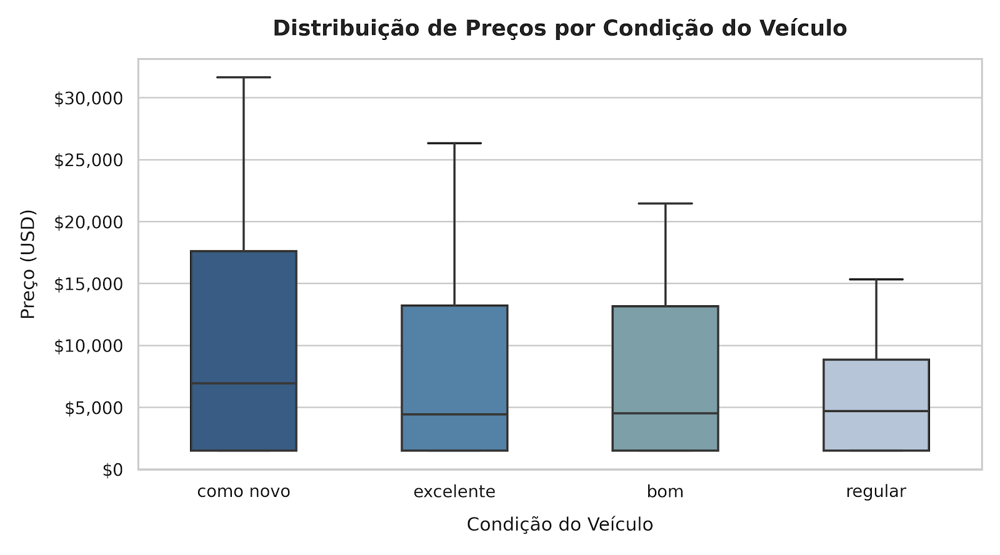
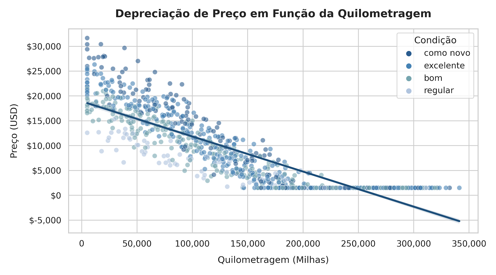
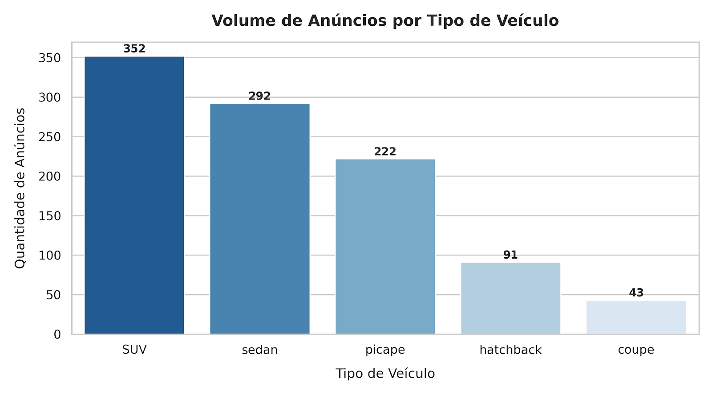

# Dashboard de Análise de Vendas de Veículos 🚗

Esta é uma aplicação web interativa desenvolvida em Python e Streamlit para análise exploratória de dados de anúncios de vendas de carros nos Estados Unidos.

## 🚀 Funcionalidades
- **Visão Geral do Mercado (Métricas)**: Cards interativos exibindo o total de anúncios, preço médio, quilometragem média e ano médio dos veículos.
- **Histograma de Quilometragem**: Distribuição interativa do odômetro dos veículos.
- **Gráfico de Dispersão (Preço vs. Odômetro)**: Análise comparativa entre preço e quilometragem, colorida pela condição do veículo.
- **Gráfico de Barras por Fabricante**: Visualização da quantidade e tipo de veículos agrupados por fabricante.
- **Tabela de Dados Brutos**: Opção para consultar e explorar as primeiras 100 linhas do conjunto de dados.
- **Controles Interativos**: Interface dinâmica com caixas de seleção (checkboxes) para personalizar a exibição dos gráficos.

--

## 📊 Análise Visual & Principais Insights

### 1. Relação entre Condição do Veículo e Valor de Venda

* **Hipótese:** Veículos em condição "como novo" possuem uma mediana de valor significativamente superior e menor variação de desvalorização em relação aos categorizados como "bom" ou "regular".
* **Conclusão:** A transição da condição "como novo" para "excelente/bom" gera a maior perda percentual imediata no valor mediano de revenda. No entanto, carros em condição "excelente" e "boa" mantêm faixas de preços sobrepostas, indicando que outros fatores (como marca e modelo) contrabalançam o estado do veículo.

---

### 2. Depreciação em Função da Quilometragem e Idade

* **Hipótese:** A perda de valor ocorre de forma exponencial nos primeiros anos e tende a estabilizar quando o veículo atinge alta rodagem.
* **Conclusão:** Existe uma forte correlação negativa entre quilometragem e preço ($r < -0.6$). A curva de depreciação é mais acentuada até as **100.000 milhas**. Após esse marco, a taxa de perda de valor diminui sensivelmente, atingindo um patamar mínimo no mercado secundário.

---

### 3. Volume de Anúncios e Demanda por Categoria

* **Insight Chave:** As categorias **SUV** e **Sedan** concentram a grande maioria do volume total de anúncios da plataforma. Esse comportamento demonstra uma clara preferência do público consumidor por veículos utilitários e de passeio familiar no mercado de seminovos.

--

## 🛠️ Tecnologias
- Python 3
- Pandas
- Plotly Express
- Streamlit

--

## 🔗 Aplicação Online
Acesse o dashboard publicado no Render: https://vehicles-env-8623.onrender.com/
